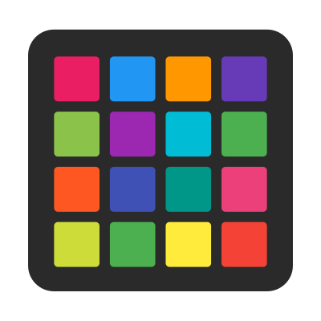
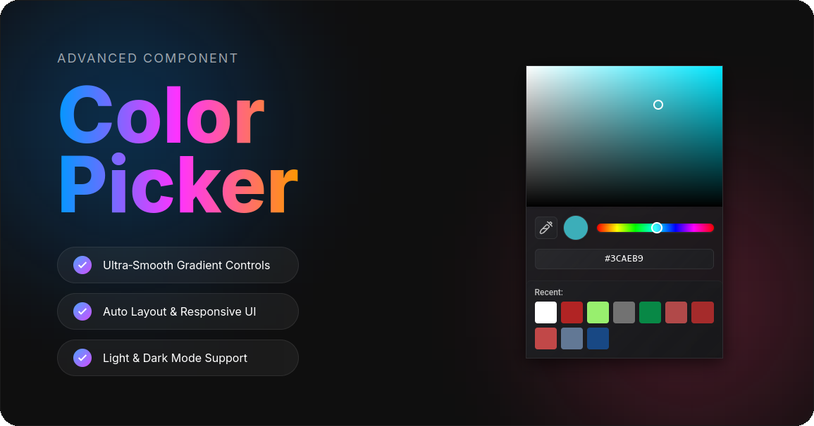

<p align="center">
  
</p>

<h1 align="center">Better Color Picker</h1>
<p align="center">
  A Firefox extension that replaces the native color picker with a custom, feature-rich interface.
</p>
<p align="center">
  
</p>

## Features

- Gradient-based saturation/lightness selector
- Hue slider with rainbow gradient
- Hex color input with live validation
- Recent colors (automatically saves up to 14)
- Works on all websites with `<input type="color">`

## Installation

### From AMO (Firefox Add-ons)

Coming soon

## Development

1. Clone this repository
2. Runs the following commands

```bash
npm install
npm run build
```

3. Navigate to `about:debugging` in Firefox
4. Select `dist/manifest.json`

To run tests:

```bash
npm test         # Run unit tests
npm run test:e2e # Run e2e tests
```

## Requirements

- Firefox 109+
- Manifest V3

## License

MIT
